# Active Context

## Current Work Focus

**Phase Completed**: Phase 4 - Template Generation Engine ✅  
**Current Phase**: Ready for Phase 5 - CLI Interface  
**Mode**: Ready for next implementation phase

## Recent Changes (Phase 4 Completion)

### ✅ Template Generation Engine

- **File**: `src/utils/template-generation.ts`
- **Features**: Complete Handlebars integration, compilation caching, error handling
- **API**: `TemplateGenerator` class, `generatePrompt()` function, `displayGeneratedPrompt()`

### ✅ Handlebars Integration

- **Template Compilation**: Handlebars compilation with caching and size limits
- **Context System**: Automatic parameter mapping with metadata and utilities
- **Built-in Helpers**: String manipulation, conditionals, and utility functions
- **Error Handling**: `TemplateGenerationError` with detailed messaging

### ✅ Performance Features

- **Compilation Caching**: Templates cached by name for reuse
- **Size Limits**: 100KB default template size limit for security
- **Generation Speed**: 11ms generation time for code-review template
- **Memory Efficiency**: Efficient helper registration and template storage

### ✅ Verification Testing

- Created and ran generation tests confirming:
  - Handlebars compilation and rendering working correctly
  - Generated 497-character code review prompt successfully
  - All 4 parameters properly processed and displayed
  - Performance metrics captured (11ms generation time)

## Phase 4 Technical Success

**Generation Results**: ✅ Template generated successfully with proper formatting  
**Performance**: 11ms generation time with 497-character output  
**Integration**: All systems working together seamlessly  
**Error Handling**: Comprehensive template execution error handling

## Next Steps (Phase 5)

### 1. CLI Entry Point

- Create `src/cli.ts` with commander.js setup
- Configure main CLI structure and global options
- Set up help system and version information

### 2. List Command

- **Command**: `ai-prompts list` (or `ls`)
- **Features**:
  - Display available templates with descriptions
  - Show parameter counts and requirements
  - Format output for easy template selection

### 3. Generate Command

- **Command**: `ai-prompts generate <template-name>` (or `gen`)
- **Features**:
  - End-to-end workflow: discover → select → collect → generate
  - Interactive parameter collection
  - Template generation and display
  - Output formatting options

### 4. Integration Testing

- Test full CLI workflow from command to output
- Verify error handling in CLI context
- Confirm user experience is smooth and intuitive

## Active Decisions

1. **Template Generation**: Using Handlebars with comprehensive caching
2. **Performance**: Template compilation caching for optimal speed
3. **Error Handling**: Detailed error messages with template context
4. **Output Format**: Clean formatting with metadata display

## Current Architecture State

```mermaid
stateDiagram-v2
    %% Purpose: Show current CLI architecture with Phase 4 complete
    %% Key Rule: All core systems functional, ready for CLI interface
    %% Critical: Template generation completes the data flow

    %% TEMPLATE DISCOVERY (Phase 2 - Complete)
    %% Purpose: Find and load template configurations
    state TemplateDiscovery {
        %% File system scanning and validation
        [*] --> ScanFiles : Recursive directory scan
        ScanFiles --> LoadConfigs : Dynamic imports
        LoadConfigs --> ValidateConfigs : TemplateConfig validation
        ValidateConfigs --> CacheTemplates : Store in registry
        CacheTemplates --> [*] : Templates ready
    }

    %% PARAMETER COLLECTION (Phase 3 - Complete)
    %% Purpose: Interactive collection of template parameters
    state ParameterCollection {
        %% Interactive prompting workflow
        [*] --> GeneratePrompts : Create inquirer prompts from ParameterConfig
        GeneratePrompts --> CollectInput : Interactive user prompts
        CollectInput --> ValidateInput : Type validation and conversion
        ValidateInput --> [*] : Parameters ready
    }

    %% TEMPLATE GENERATION (Phase 4 - Complete)
    %% Purpose: Compile and render templates with collected parameters
    state TemplateGeneration {
        %% Template compilation and rendering
        [*] --> CompileTemplate : Handlebars compilation with caching
        CompileTemplate --> PrepareContext : Map parameters to context
        PrepareContext --> RenderTemplate : Execute template rendering
        RenderTemplate --> FormatOutput : Clean and validate output
        FormatOutput --> [*] : Generated prompt ready
    }

    %% CLI INTERFACE (Phase 5 - Next)
    %% Purpose: Command-line interface for user interaction
    state CLIInterface {
        %% Command processing workflow
        [*] --> ParseCommand : Commander.js argument parsing
        ParseCommand --> ListTemplates : Show available templates
        ParseCommand --> SelectTemplate : Choose template for generation
        SelectTemplate --> [*] : Route to appropriate workflow
    }

    %% Main workflow transitions
    [*] --> CLIInterface : User runs CLI command (NEXT)
    CLIInterface --> TemplateDiscovery : Discover available templates
    TemplateDiscovery --> ParameterCollection : Select template and collect params
    ParameterCollection --> TemplateGeneration : Generate prompt with params
    TemplateGeneration --> [*] : Display generated prompt
```

## Ready for Phase 5

The template generation engine is complete and tested. We now have:

- Template discovery and registry (Phase 2) ✅
- Interactive parameter collection (Phase 3) ✅
- Template generation engine (Phase 4) ✅
- Ready to implement CLI interface that connects all systems (Phase 5)

**Key Achievement**: End-to-end template processing pipeline is functional!

- Template discovered: `code-review` found successfully
- Parameters collected: 4 parameters with type validation
- Prompt generated: 497 characters in 11ms with proper formatting

The CLI interface will complete the user-facing functionality.
