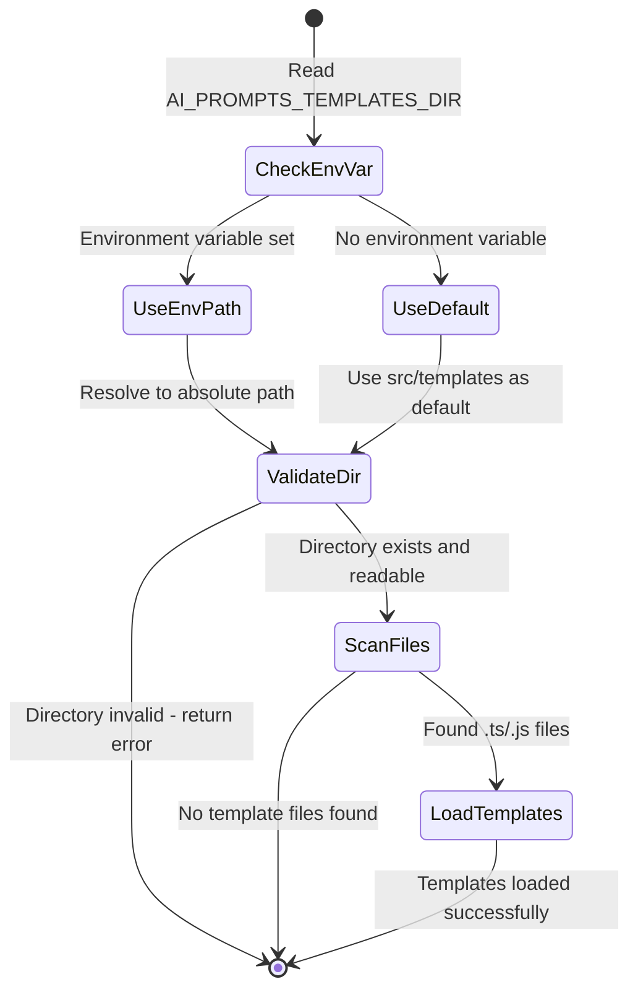

# System Patterns

## Architecture Overview

The AI Prompt Templates CLI follows a modular architecture with clear separation of concerns:

## Core Architecture Patterns

### Standardized Template Configuration Pattern

```typescript
// Standard template configuration interface
interface TemplateConfig {
  name: string;
  description: string;
  template: string;
  parameters: Record<string, ParameterConfig>;
}

interface ParameterConfig {
  description: string;
  required: boolean;
  defaultValue?: string;
  type: "string" | "number" | "boolean";
}

// Example template implementation
export const codeReviewConfig: TemplateConfig = {
  name: "code-review",
  description: "Generate a code review prompt",
  template: `
Review this {{language}} code in {{file}}:
{{#if changes}}
Recent changes: {{changes}}
{{/if}}
`,
  parameters: {
    file: {
      description: "Path to the file being reviewed",
      required: true,
      type: "string",
    },
    language: {
      description: "Programming language of the file",
      required: true,
      type: "string",
    },
    changes: {
      description: "Description of recent changes",
      required: false,
      defaultValue: "",
      type: "string",
    },
  },
};

export default codeReviewConfig;
```

### Generic Parameter Collection Pattern

```typescript
// CLI prompts based on template configuration
const collectParams = async (config: TemplateConfig) => {
  const params: Record<string, string> = {};

  for (const [key, paramConfig] of Object.entries(config.parameters)) {
    if (paramConfig.required) {
      const value = await prompt(`Enter ${paramConfig.description}:`);
      params[key] = value;
    } else {
      const value = await prompt(
        `Enter ${paramConfig.description} (optional, default: "${paramConfig.defaultValue}"):`
      );
      params[key] = value || paramConfig.defaultValue || "";
    }
  }

  return params;
};
```

### Template Discovery System

### Template Location Configuration

Templates are stored in a configurable directory:

- **Environment Variable**: `AI_PROMPTS_TEMPLATES_DIR`
- **Default Fallback**: `src/templates/` (when environment variable not set)
- **Path Support**: Both relative and absolute paths supported
- **Validation**: Directory existence and readability checked at runtime

### Discovery Process



1. **Configuration Resolution**: Check `AI_PROMPTS_TEMPLATES_DIR` environment variable, fallback to `src/templates`
2. **Directory Validation**: Verify directory exists and is readable
3. **File Scanning**: Recursively scan for `.ts` and `.js` files
4. **Template Loading**: Dynamic import and validation of each template file
5. **Registry Population**: Store valid templates in registry with error tracking

### Command Pattern (Commander.js)

```typescript
// CLI remains generic and works with any template
program
  .command("generate <template>")
  .option("-o, --output <file>", "Output file path (default: stdout)")
  .action(generateCommand);
```

## Design Decisions

### Standardized Configuration vs. Individual Interfaces

- **Choice**: Standardized TemplateConfig interface for all templates
- **Rationale**: Enables generic CLI code, better maintainability, consistent UX
- **Implementation**: Each template exports a config object following the standard schema
- **Benefit**: CLI framework can work with any compliant template without modification

### Parameter Configuration Schema

- **Choice**: Explicit parameter definitions with required/optional flags and defaults
- **Rationale**: Clear contract, better validation, consistent user experience
- **Implementation**: Each parameter specifies description, required flag, type, and optional default
- **Constraint**: Simple types only (string, number, boolean)

### Template Registration Pattern

```typescript
// Validation for template configuration compliance
const isValidTemplateConfig = (config: any): config is TemplateConfig => {
  return (
    typeof config === "object" &&
    typeof config.name === "string" &&
    typeof config.description === "string" &&
    typeof config.template === "string" &&
    typeof config.parameters === "object" &&
    Object.values(config.parameters).every(isValidParameterConfig)
  );
};

const isValidParameterConfig = (param: any): param is ParameterConfig => {
  return (
    typeof param === "object" &&
    typeof param.description === "string" &&
    typeof param.required === "boolean" &&
    ["string", "number", "boolean"].includes(param.type) &&
    (param.defaultValue === undefined || typeof param.defaultValue === "string")
  );
};
```

## Component Relationships

### Template System Flow

1. **Discovery**: Scan src/templates for TypeScript files
2. **Loading**: Import and validate template configs against standard schema
3. **Registration**: Store valid templates in registry with their configurations
4. **Parameter Collection**: Generic prompts based on parameter configurations
5. **Validation**: Type and requirement validation based on parameter config
6. **Generation**: Apply collected parameters to Handlebars template
7. **Output**: Display to stdout or save to file

### Error Handling Strategy

- **Template not found**: Clear error with available templates list
- **Invalid template config**: Detailed validation errors during discovery
- **Missing required parameters**: Re-prompt with clear error messages
- **Invalid parameter types**: Type validation with helpful conversion hints
- **File operations**: Graceful handling with user-friendly messages
- **Runtime errors**: Distinguish between user errors and system errors

### CLI Error Handling

```typescript
// Consistent error handling pattern
try {
  const templateDef = getTemplate(templateName);
  if (!templateDef) {
    throw new TemplateNotFoundError(`Template "${templateName}" not found`);
  }

  const params = await collectInteractiveParams(templateDef.config);
  const result = await generatePrompt(templateDef.config, params);

  if (outputFile) {
    await writeFile(outputFile, result);
    console.log(`Generated prompt saved to ${outputFile}`);
  } else {
    console.log(result);
  }
} catch (error) {
  if (error instanceof TemplateError) {
    console.error(`Template error: ${error.message}`);
    process.exit(1);
  }
  throw error; // Re-throw unexpected errors
}
```
